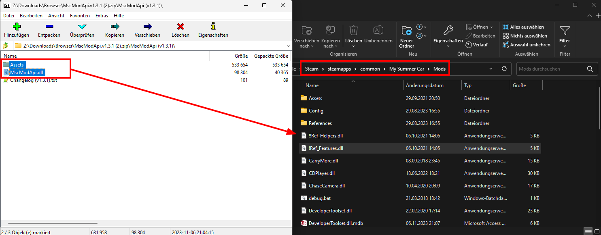
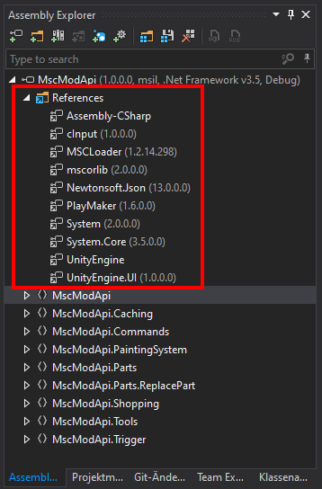

# MscModApi

A help for mod makers

## Table of contents

<!-- TOC -->
* [MscModApi](#mscmodapi)
  * [Table of contents](#table-of-contents)
  * [Requirements](#requirements)
  * [Installation](#installation)
    * [Users](#users)
    * [Mod Authors](#mod-authors)
  * [Features](#features)
    * [Important info about ***Features***](#important-info-about-features)
<!-- TOC -->

---

## Requirements

| Requirement  | Version                                                                                               | Link                                                              |
|--------------|-------------------------------------------------------------------------------------------------------|-------------------------------------------------------------------|
| MySummerCar  |   (game => open console => type ver => buildID) | [Steam](https://store.steampowered.com/app/516750/My_Summer_Car/) |
| MscModLoader |                                                     | [GitHub](https://github.com/piotrulos/MSCModLoader)               |

---

## Installation

### Users

1. Open the [GitHub releases page](https://github.com/MarvinBeym/MscModApi/releases)
2. Download the **.zip** file under **Assets**
    - Note that different mods may require different versions, only one version can be installed, meaning mods may not
      be compatible.
    - Mod authors are advised to have a clear version requirement and to watch out for updates.
3. **Extract** or **Open** the archive with your favorite archiving tool.  
   Archiving tool examples:
    - [7Zip](https://www.7-zip.de/)
    - [WinRar](https://winrar.de/index.php)
    - Win10+ build in
4. Inside the **Extracted** or **Opened** Archive should be a single folder. Usually called **MscModApi (\<version>)**.
    - Open that folder.
5. Inside that folder should be 2 files and 1 folder (with more files in it).
    - ``Assets`` folder.
    - ``MscModApi.dll`` (depending on how your Windows is setup, you will not see the extension **.dll**).
    - ``Changelog (<version>).txt`` (this is just a text file, not needed to use the mod).
6. Open the ``Mods`` folder for your game.
    - Where that folder is, depends what you selected when you installed **MscModLoader** using the **MSCPatcher**
      tool.   
      Possible locations are:
        - ``Steam\steamapps\common\My Summer Car\Mods``
        - ``C:\Users\<your windows username>\Documents\My Summer Car\Mods``
        - ``C:\Users\<your windows username>\AppData\LocalLow\Amistech\My Summer Car\Mods``
7. **COPY** the ``Assets`` folder **AND** the ``MscModApi.dll`` file into that **Mods** folder
8. When asked if you would like to overwrite existing files, select **Yes**.
9. Launch the game and the Mod should be running.

### Mod Authors

The best way to use **MscModApi** while developing a mod is to clone the entire repository.  
This will guarantee that your **IDE** (Visual Studio) can "look" into the code of the MscModApi.

1. Clone the repository to a folder of your choosing.
2. Open your **IDE** and open the **.svn** file located in the **Source code** folder.
3. Select the **Debug** Profile in the top bar
4. Press **CTRL** + **SHIFT** + **B** to compile the source
    - It's possible that references are missing. Make sure to add those. They are all located inside your games *
      *mysummercar_Data\Managed** folder.
      
5. Navigate to **\<location of the cloned MscModApi folder>/Source code/MscModApi/bin/Debug**
6. Copy the ``MscModApi.dll`` & ``MscModApi.pdb`` file into your games ``Mods`` folder.
7. run the ``debug.bat`` file that should be located inside that folder (See MscModLoader documentation, this is general
   mod dev information).
    - The MscModApi documentation also has instructions on how to automate the copying & debug.bat executing steps.
8. Inside your mod, add a new reference pointing to that ``MscModApi.dll`` file   
   (similar to how you did earlier for files like **Assembly-CSharp** and such)
9. Happy developing.

---

## Features

- Creating parts that can be installed on the Satsuma
    - Parts can be bolted with customizable screws & nuts
    - Ability to implement painting of parts using the existing spray bottles
    - Automated saving, no need to deal with NewGame resetting, saving on load, loading the data manually.
    - Ability to pack multiple parts into boxes
        - **Kit** box: multiple different parts
        - **Box** box: multiple of the same part  
          (for example: spark plugs, they don't need to be all different)
            - Automated creation of box model (custom usage possible)
    - Extensive Event system on parts. Allows to listen to different events and execute code when they happen.
        - Pre & Post Event **X** trigger
            - Saving
            - Install (on parent)
            - Uninstall (from parent)
            - Bolted (while installed on parent)
            - Unbolted (while installed on parent)
            - InstallOnCar (part or it's parent (or the parent of that ...) get's put on the car (SATSUMA))
            - UninstallFromCar
            - BoltedOnCar
            - UnboltedOnCar
        - Event system for activating Behaviour 'Code running on the side' depending on an event. Disabling the
          behaviour when the opposite event is occurs.
            - Example: Behaviour activated on ``Install (on parent)``,   
              when the part is uninstalled from the parent and the ``Uninstall (from parent)`` event is called. the
              Behaviour is deactivated.
- Shop system.
    - Add Shops to a global Shop all mods can use.
    - Define a custom price
    - Add images
    - Add boxes of parts (**Kit** & **Box**) (one price for all)
    - Two shops exist on the map. One at **Fleetari** and one at **Teimo**
    - Customizable spawn location for **ShopItems**. With some "easy to use" predefined.
- Several C# Extension methods.
- Helper utility
    - Some examples:
        - FindFsmOnGameObject
        - CombinePaths
        - LoadAssetBundle
        - CheckCloseToPosition
- Logging for each individual mod, containing general game information (installed mods, versions, ....)
- UserInteraction utility: showing messages to the used, check if playes is looking at an object, detect interactions

### Important info about ***Features***

Interpret this list as a "Showcase",   
exact information of each individual feature and how to use, what they do, ...   
should be researched in the actual Documentation.

---
